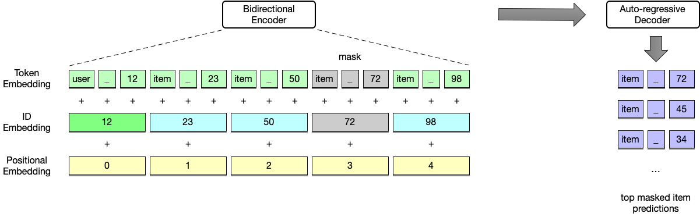
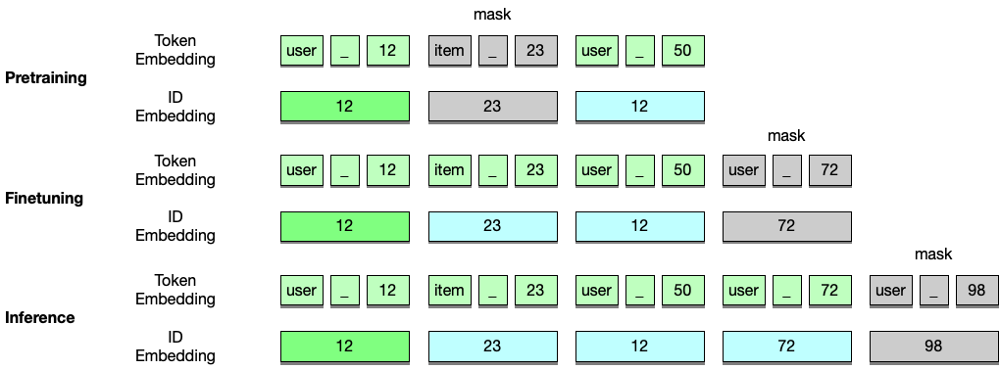

# GenRec: Generative Sequential Recommendation with Large Language Models

Source code for our paper `GenRec: Generative Sequential Recommendation with Large Language Models`.

## Environment
- Python==3.8
- PyTorch==1.12.1
- transformers==4.22.2
- tensorboardx==2.5.1
- lxml==4.9.1
- beautifulsoup4==4.11.1
- bs4==0.0.1
- stanza==1.4.2
- sentencepiece==0.1.97
- ipdb==0.13.9

## Model

### Framework


### Masking Strategy


## Datasets
Finetune datasets are available in the datasets folder. We will publish the pretrain datasets soon.

## Pretraining

```Bash
python genrec/train.py -c config/pretrain_amazon_sports.json
```

## Finetuning

```Bash
python genrec/train.py -c config/finetune_amazon_sports.json -pmp output/20240828_204904/epoch_10.mdl
```

## Evaluate

```Bash
python genrec/evaluate.py -c config/evaluate_amazon_sports.json
```

Please raise your questions or comments in the issues.
